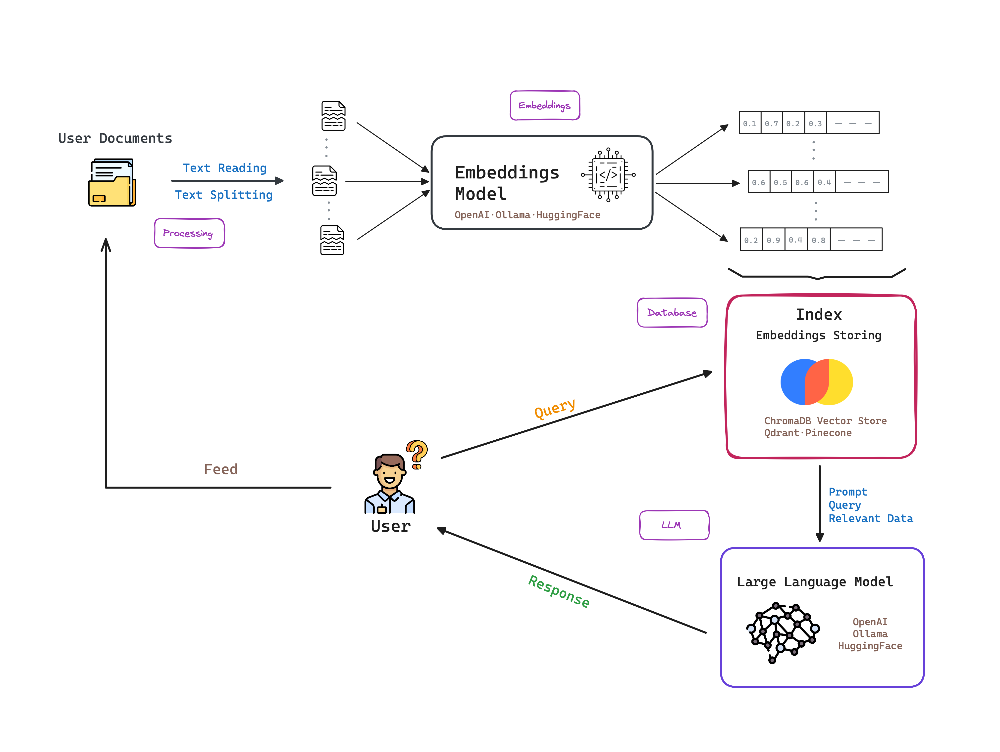

# AMAR: Ask Me Anything with RAG

## Table of Contents

1. [Objective](#Objective)
2. [Repository Structure](#Repository-Structure)
3. [Virtual Environment](#Virtual-Environment)
    3.1. [Tools used](#Tools-used)
4. [Running the Web App](#Running-the-Web-App)
    4.1. [Demo](#Demo)
5. [Future Work](#Future-Work)

## 1. Objective

The objective of this project is to create a simple and easy to use tool that allows users to ask questions about local data. It works by serving local LLM models and a RAG model to answer questions about the data.

The following diagram shows the architecture of the project:




## 2. Repository Structure

The repository is structured as follows:

```
├── README.md <- The top-level README for developers using this project.
|
|
├── app.py <- Code to deploy a web app with Streamlit
│
├── *-environment.yaml <- Virtual environment configuration files for pro* and dev*
│
├── tmp <- Folder for temporary files (uploads)
│
├── configs <- Folder for app configuration files
│
├── notebooks <- Folder where jupyter notebooks are located. Development purposes
|
└── src  <- Source code for use in this project.
    ├── processing <- Data processing code. Reading and chunking
    ├── database <- Database related code
    ├── embeddings <- Embedding related code
    ├── llm <- LLM related code
    └── helpers <- Various helper functions
```

## 3. Virtual Environment

To ensure the reproducibility of the project, it is recommended to create a virtual environment.
[Conda](https://www.anaconda.com) is a package manager that allows you to create virtual environments with different Python versions and install the required dependencies.

The following commands can be used to create a virtual environment using conda:

```bash
conda env create -f dev-environment.yaml
```

### 3.1. Tools used

The following tools were used in the development of the project:
- [SuryaOCR](https://github.com/VikParuchuri/surya): OCR tool used to extract text from scanned documents.
- [Ollama](https://github.com/ollama/ollama): Get up and running with large language models locally. Used for embedding text data and LLMs serving.
- [ChromaDB](https://www.trychroma.com): Embedding database used to store and retrieve embeddings.
- [Streamlit](https://streamlit.io): Streamlit turns data scripts into shareable web apps in minutes. All in pure Python. No front‑end experience required.


## 4. Running the Web App

We prepared a simple web app to interact with the models. To run the app, execute the following command:

```bash
streamlit run app.py
```

### 4.1. Demo

The following is a demo of the web app:


## 5. Future Work

- [ ] Add more models to the app: Hugging Face models, OpenAI models, etc.
- [ ] Prevent inserting the same document multiple times in the database.
